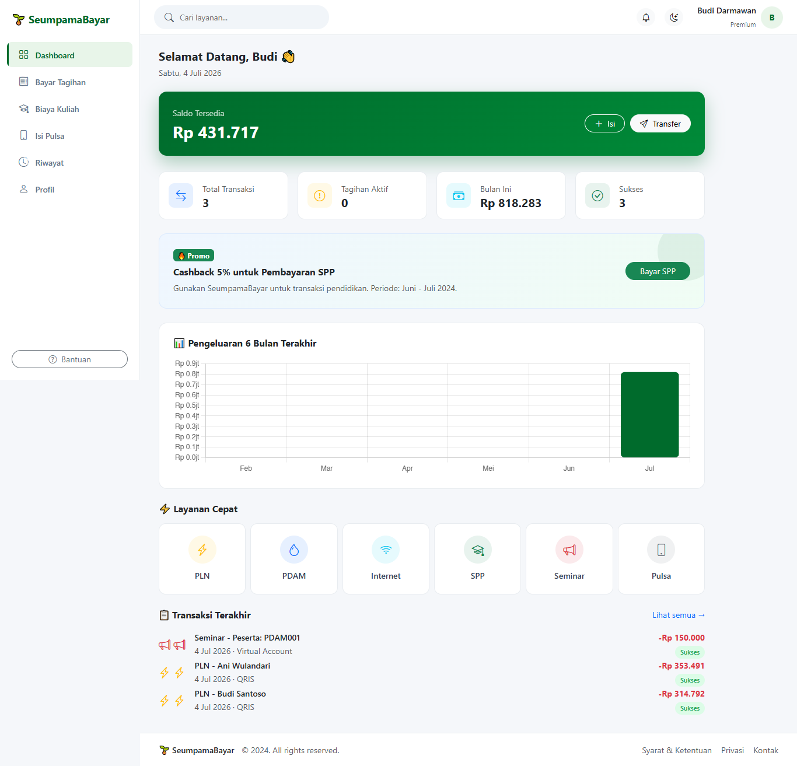
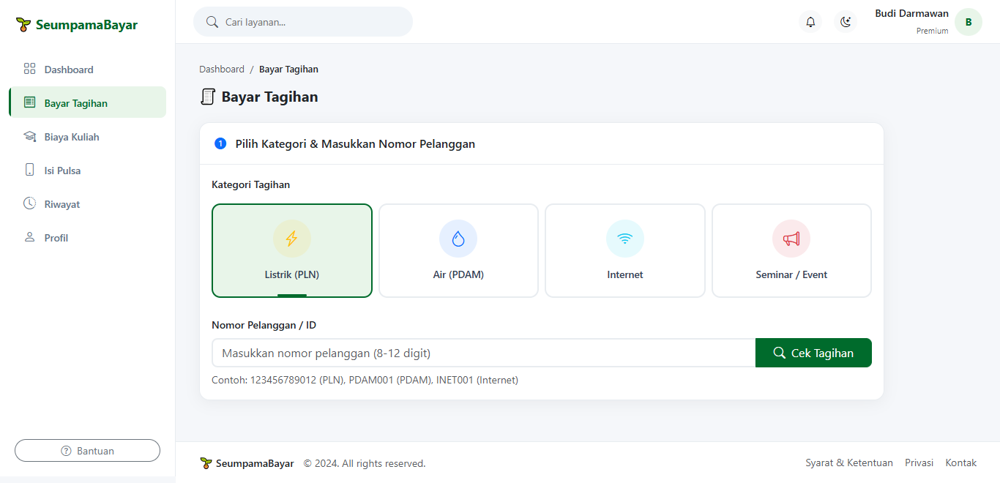
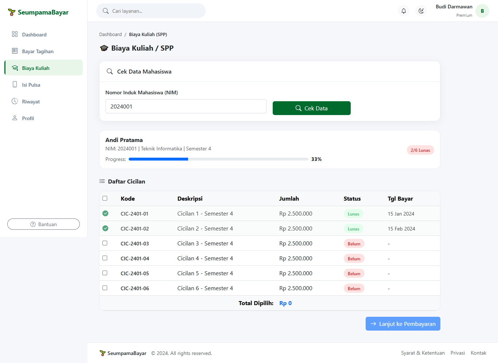
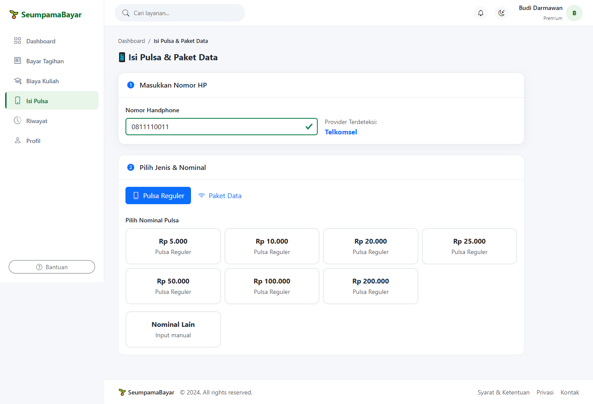
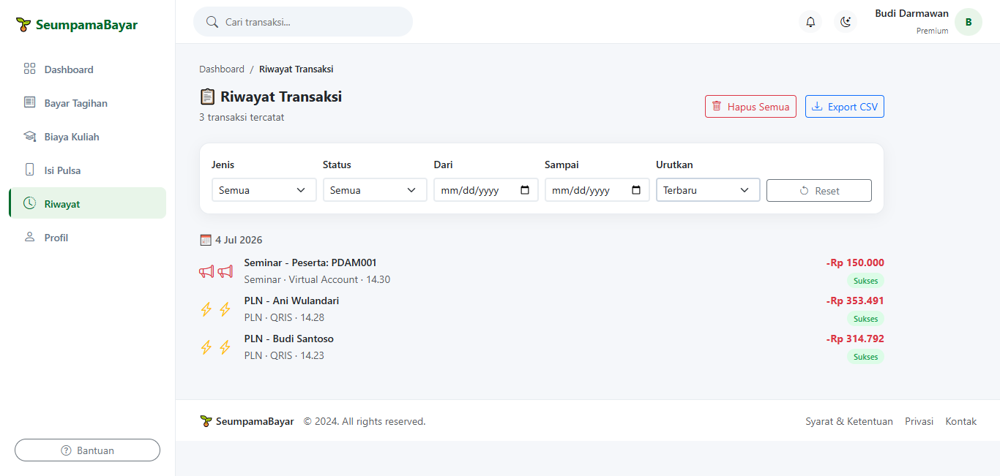
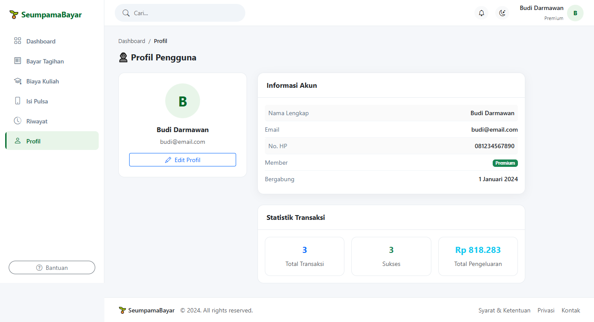

# 🌱 SeumpamaBayar

**Aplikasi Web Pembayaran Tagihan Multi-Layanan & Pengisian Pulsa**

Aplikasi frontend simulasi pembayaran tagihan (PLN, PDAM, Internet, Seminar) dan pengisian pulsa/paket data. Dibangun dengan **HTML5, CSS3, Bootstrap 5, dan Vanilla JavaScript (ES6+)**. Seluruh data disimpan di **LocalStorage**.

---

## 🚀 Demo Live

> 🔗 *[https://username.github.io/seumpamabayar](https://username.github.io/seumpamabayar)* *(ganti dengan URL deploy Anda)*

---

## 📸 Screenshot

### 💻 Desktop
| Dashboard | Bayar Tagihan | SPP |
|-----------|---------------|-----|
|  |  |  |

| Isi Pulsa | Riwayat | Profil |
|-----------|---------|--------|
|  |  |  |

### 📱 Mobile
| Dashboard | Bayar Tagihan | SPP |
|-----------|---------------|-----|
|  |  |  |

---

## ✨ Fitur Utama

### 🔹 Dashboard
- Ringkasan saldo simulasi
- Statistik: total transaksi, tagihan aktif, pengeluaran bulanan
- Grafik pengeluaran 6 bulan terakhir (Chart.js)
- Promo banner interaktif
- Quick access 6 layanan (PLN, PDAM, Internet, SPP, Seminar, Pulsa)
- Riwayat transaksi terakhir

### 🔹 Bayar Tagihan
- **4 kategori**: PLN, PDAM, Internet, Seminar/Event
- Input nomor pelanggan + validasi real-time
- Cek tagihan dengan loading state
- Detail tagihan lengkap (nama, alamat, periode, denda, jatuh tempo)
- **3 metode pembayaran**:
  - 🏦 **Virtual Account** — Generate nomor VA unik (BCA, BNI, Mandiri)
  - 📱 **QRIS** — QR Code asli (QRCode.js) + countdown 5 menit
  - 🏪 **Teller/Kasir** — Kode bayar + copy ke clipboard

### 🔹 Biaya Kuliah (SPP)
- Input NIM + validasi format
- Progress bar pembayaran semester
- Daftar cicilan 6-8 item dengan status Lunas/Belum
- Pilih beberapa cicilan sekaligus (checkbox + select all)
- Total otomatis terhitung

### 🔹 Isi Pulsa & Paket Data
- **6 provider**: Telkomsel, XL, Indosat, Tri, Smartfren, Axis
- Deteksi provider otomatis dari prefix nomor HP
- Tab Pulsa Reguler + Paket Data
- Nominal pulsa: Rp 5.000 - Rp 200.000 + custom input
- Paket data berbeda tiap provider

### 🔹 Riwayat Transaksi
- Semua transaksi tersimpan di LocalStorage
- Filter: jenis, status, rentang tanggal
- Search by keyword
- Sort: terbaru, terlama, termahal, termurah
- Export CSV
- Hapus satu / hapus semua (dengan konfirmasi)
- Cetak struk (Print window)
- Download struk PDF (jsPDF)

### 🔹 Profil Pengguna
- Edit nama, email, nomor HP, inisial avatar
- Statistik transaksi pribadi
- Data tersimpan di LocalStorage

### 🔹 FAQ / Bantuan
- 8 pertanyaan umum
- Search FAQ by keyword
- Accordion interaktif + keyboard accessible
- Kontak WhatsApp & Email

### 🔹 Dark Mode
- Toggle light/dark theme
- Preferensi tema disimpan di LocalStorage
- Transisi halus antar tema

### 🔹 Fitur Pendukung
- ✅ Responsive design (mobile, tablet, desktop)
- ✅ Validasi form real-time
- ✅ Toast notification (sukses, error, info)
- ✅ Loading spinner setiap proses
- ✅ Modal konfirmasi sebelum bayar
- ✅ Copy VA / kode bayar ke clipboard
- ✅ Hover effects di semua elemen interaktif
- ✅ Animasi transisi (fade in, slide in)
- ✅ Keyboard accessible (Enter/Space)
- ✅ ARIA labels untuk accessibility
- ✅ Breadcrumb navigasi
- ✅ Edge cases handled (saldo kurang, tagihan lunas, NIM tidak ditemukan)

---

## 🛠 Teknologi

| Teknologi | Versi | Kegunaan |
|-----------|-------|----------|
| **HTML5** | — | Struktur halaman semantic |
| **CSS3** | — | Custom properties, Flexbox, Grid, Animasi |
| **Bootstrap 5** | 5.3.0 (CDN) | UI framework |
| **Bootstrap Icons** | 1.11.0 (CDN) | Icon library |
| **Vanilla JavaScript** | ES6+ | DOM manipulation, event handling, state |
| **Chart.js** | 4.x (CDN) | Grafik pengeluaran dashboard |
| **QRCode.js** | 1.0.0 (CDN) | Generate QR code QRIS |
| **jsPDF** | 2.5.1 (CDN) | Export struk ke PDF |
| **LocalStorage** | — | Penyimpanan data client-side |

---

## 📁 Struktur Proyek
